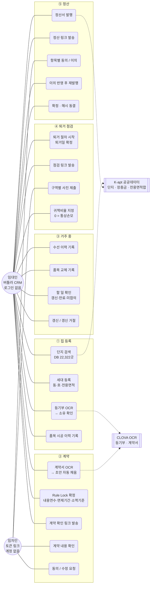
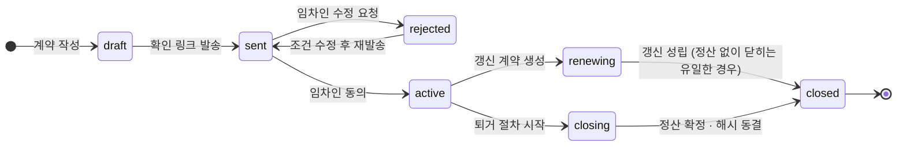
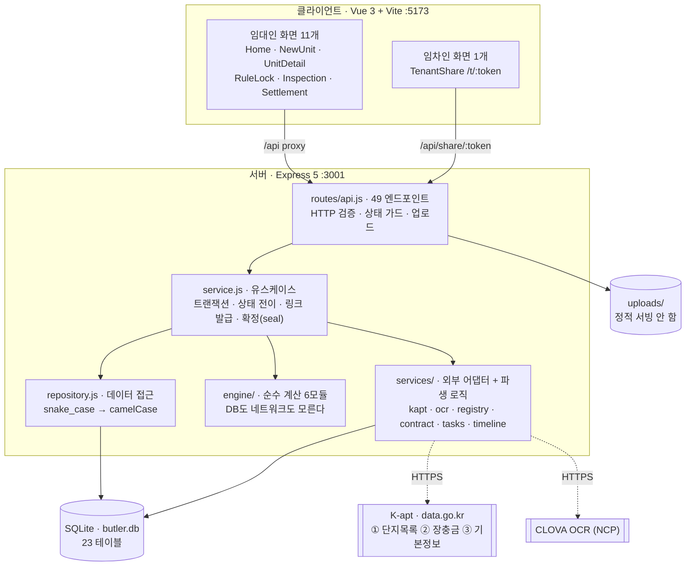
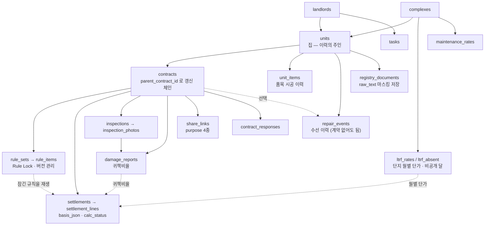

# PoC 구조 요약 — 유스케이스 · 아키텍처

> 2026-09-23 기준. 발표·심사용 정리본의 저장소 사본입니다.
> 기획안 대비 달라진 점, 검증 결과, 발표 구성안을 포함한 전체 문서는 Notion
> **「260923 - PoC 내용정리」**(버틀러 컴퍼니 하위)에 있습니다.
>
> 구현 과정의 판단·버그 기록은 [progress.md](progress.md), 전체 명세는 [V2-SPEC.md](V2-SPEC.md) 입니다.

| 항목 | 값 |
|---|---|
| 구성 | Vue 3 + Vite (`:5173`) / Express 5 + SQLite (`:3001`) |
| 규모 | 서버 22개 모듈 · 화면 13개 · 테이블 23개 |
| 테스트 | `node --test` 10묶음 **200건 전부 통과** |
| 외부 연동 | K-apt 공공데이터 3종 · CLOVA OCR (**둘 다 없어도 전 구간 동작**) |
| 검증 | 집 3채 × 계약 5건(갱신 포함) = 15계약 · 정산 확정 9건을 실제 HTTP API로 주행 |

---

## 1. 유스케이스

설계의 핵심은 **임차인 역할이 시스템에 존재하지 않는다**는 것입니다.
임차인은 계정도 앱도 없이 `/t/:token` 링크 하나로만 들어옵니다.



토큰은 **용도(purpose)를 검사**하므로 정산 링크로 계약을 고칠 수 없습니다.

| 링크 용도 | 임차인이 하는 일 | 끝나면 |
|---|---|---|
| `contract_review` | 계약 조건·Rule Lock 확인 → 동의 또는 수정 요청 | 동의 시 계약 `active`, 집 `occupied` |
| `repair_report` | 거주 중 수선 신고 | *(PoC 미구현)* |
| `inspection` | 구역별 사진 제출 | 링크 닫힘 → 임대인 검토로 |
| `settlement` | 항목별 동의 / 이의 제기 | 전원 동의 시에만 확정 가능 |

### 상태 전이



집의 상태는 계약을 따라갑니다 — `vacant → contracting → occupied → closing → vacant`.
집이 공실로 돌아오는 시점은 **퇴거일이 아니라 정산 확정 시점**입니다. 퇴거일이 지나도
정산이라는 할 일이 남아 있고, 다음 임차인 계약이 이미 있으면 되돌리지 않습니다.

---

## 2. 아키텍처



> **`engine/`은 DB도 네트워크도 모르는 순수 함수입니다.**
> 확정된 정산서를 몇 년 뒤에 다시 계산해 같은 숫자가 나오는지 검증할 수 있어야 하기
> 때문입니다. 계산이 DB 상태나 API 응답에 의존하면 그 재현이 불가능해집니다.
> 확정 시점에 전체 스냅샷을 JSON으로 굳히고 SHA-256 해시를 남기는 것도 같은 이유입니다.

### 외부 API

| API | 쓰는 값 | 쓰이는 곳 |
|---|---|---|
| 공동주택 단지 목록제공 서비스 (15057332) | 전국 단지 코드·이름·주소 | 집 추가 1단계 단지 검색 |
| 공동주택관리비(장기수선충당금)정보서비스 (15059160) | 단지 월 부과**총액** `sLevy` | 장충금 계산의 분자 |
| 공동주택 기본 정보제공 서비스 (15058453) | 단지 **전용면적합** `privArea` | 장충금 계산의 분모 |
| CLOVA OCR General | 등기부·계약서 이미지 → 텍스트 | 소유 확인, 계약 초안 |

```
세대 단가(원/㎡) = sLevy ÷ privArea
장충금 반환액   = Σ (월별 단가 × 세대 전용면적 × 점유비율)
```

두 번째 API가 주는 것은 단지 **전체 총액**이라, 세 번째 API의 면적으로 나눠야 세대 단가가
됩니다. 공공데이터의 최소 단위는 단지(`kaptCode`)이고 **세대별 API는 존재하지 않습니다.**

단지 검색은 **로컬 DB만** 봅니다. K-apt 목록 API(V4)에 단지명 검색 파라미터가 없고 전국
목록을 페이지로만 주기 때문에, 매 검색마다 실 API를 치면 찾는 단지가 그 페이지에 없어
0건이 나옵니다. 전국 22,322곳을 한 번 받아 두고 그 위에서 검색합니다.

---

## 3. 파일별 책임

### 계산 엔진 — `server/src/engine/` (순수 함수, 수정 금지 영역)

| 파일 | 줄 | 맡은 로직 |
|---|---|---|
| `index.js` | 86 | `buildSettlement()` — 정산서 산출의 **단일 진입점**. 계산기 5개를 순서대로 호출해 8줄짜리 정산서를 만든다. **0원 줄을 지우지 않는다** |
| `dates.js` | 68 | 기간·점유비율 산정. 정산의 모든 기간 계산이 여기를 거친다 (말일 보정, 윤년, 일할) |
| `ltrf.js` | 118 | 장기수선충당금. 월별 단가 × 전용면적 × 점유비율의 누적. 결측월은 직전 단가 보간(`imputed`) |
| `restoration.js` | 162 | 원상회복 감가 + 거주 중 수선비 정산. `부담액 = 견적 × (1 − 경과/내용연수) × 귀책비율`, 면제기간·소액기준 적용 |
| `maintenance.js` | 69 | 퇴거월 관리비 일할 · 선수관리비 |
| `arrears.js` | 37 | 미납 차임 + 합의 지연이자 |

모든 계산기는 금액과 함께 **`status`·`reason`** 을 돌려줍니다.

| `status` | 뜻 | 화면 |
|---|---|---|
| `counted` | 계산했다 | 금액 표시 |
| `partial` | 일부 기간만 계산했다 | 경고 + 몇 개월분인지 |
| `unavailable` | **계산하지 못했다** | 0원 + 이유 + 대안 안내 |
| `none` | 해당 없음 | 0원 + 이유 |

0원 줄을 지우면 "해당 없음"과 "계산했더니 0원"과 **"계산을 못 했음"** 이 화면에서 전부
똑같이 사라집니다. 합계는 어차피 같습니다 — 0원은 더해도 0원입니다.

### 유스케이스·데이터 — `server/src/`

| 파일 | 줄 | 맡은 로직 |
|---|---|---|
| `routes/api.js` | 701 | HTTP 49개. 입력 검증과 **상태 가드**만 한다 (거주 중 계약의 조건 변경 거부, 계약이 붙은 집 삭제 거부). 비즈니스 규칙 없음 |
| `service.js` | 1,057 | 유스케이스 29개. 트랜잭션, 상태 전이, 공유 링크 발급, 정산서 발행·합의·**확정(seal)** |
| `repository.js` | 310 | 데이터 접근. snake_case → camelCase 변환. 집 이력 병합(`getUnitHistory`), 갱신 체인(`contractChainIds`) |
| `schema.sql` | 372 | 23개 테이블. 설계 원칙 = ①값이 아니라 **근거**를 남긴다(`basis_json`) ②규칙은 계약 시 잠기고 퇴거 시 재생된다 |
| `db.js` | 119 | SQLite 연결 + 기동 시 마이그레이션. 컬럼 추가는 `COLUMN_PATCHES`, SQLite가 못 바꾸는 제약은 테이블 재작성 |
| `env.js` | 46 | 의존성 없는 `.env` 로더. 키가 없어도 죽지 않는다 |
| `check-env.js` | 96 | `npm run check-env` — 키가 실제로 동작하는지 확인. 런타임은 실패를 삼키므로 여기서만 원인을 드러낸다 |
| `seed.js` | 43 | 임대인 '버틀러' 계정 하나만 생성. **샘플 데이터를 넣지 않는다** — 화면의 숫자가 실제 입력인지 시드인지 구분되어야 하므로 |

### 외부 어댑터·파생 로직 — `server/src/services/`

| 파일 | 줄 | 맡은 로직 |
|---|---|---|
| `kapt.js` | 234 | K-apt 3개 API 호출. 초당 요청제한 대응(300ms 간격·1회 20개월·30초 회복), Decoding 키 자동 보정 |
| `kapt-sync.js` | 245 | 받아온 값을 DB에 앉히는 계층. 총액 → 단가 환산, **공개되지 않은 달을 기록**해 다시 묻지 않음 |
| `ocr.js` | 182 | OCR 어댑터(CLOVA/Upstage). 키가 없으면 픽스처 모드로 자동 폴백 |
| `registry.js` | 148 | 등기부 파서 + 소유 검증. OCR 공백 튐 대응, 주민번호 **마스킹 후 저장** |
| `contract.js` | 212 | 표준임대차계약서 파서. 모든 필드에 `high/medium/low` 확신도를 달아 돌려준다 — 타이핑을 줄이는 것이지 조건을 확정하는 게 아니다 |
| `koreanAmount.js` | 63 | 한글 금액 파싱. 표준계약서는 금액을 한글·숫자로 병기하는데 실측에서 숫자 쪽이 깨져 **교차 검증**이 필요했다 |
| `tasks.js` | 283 | 할 일 규칙 7종. 크론 없이 홈을 열 때 현재 DB 상태에서 "지금 떠 있어야 할 할 일"을 다시 계산 |
| `timeline.js` | 86 | 주택임대차보호법 제6조의3 기준 날짜. 화면과 할 일이 **같은 날짜**를 보게 하는 단일 진실 원천 |

### 화면 — `client/src/`

| 파일 | 맡은 것 |
|---|---|
| `views/Home.vue` | 임대 현황 — 집 목록 + 할 일 |
| `views/NewUnit.vue` · `components/RegistryCheck.vue` | 집 추가 3단계. 등기부 이미지를 옆에 띄우고 OCR 값을 **입력칸**으로 둬 임대인이 고쳐 확정 |
| `views/UnitDetail.vue` | 집 상세 — 계약 기록 · 품목 시공 이력 · 수선 이력 |
| `views/NewContract.vue` / `ContractDetail.vue` / `ContractDocument.vue` | 계약 작성(OCR) · 상세 · 임차인이 받은 그대로 다시 보기 |
| `views/RuleLock.vue` | 계약 시점 규칙 확정 · 잠금 서명 |
| `views/InspectionReview.vue` | 퇴거 점검 사진 검토 · 귀책비율 지정 |
| `views/Settlement.vue` · `components/LineDetail.vue` | 정산서. 받을 돈/공제할 돈 2그룹 + 월별 근거 펼침 |
| `views/TenantShare.vue` | **임차인 화면 전부.** 토큰 용도에 따라 4가지로 분기 |
| `style.css` | Clay 디자인 토큰 `:root` 한 곳 |

---

## 4. 데이터 모델 (23 테이블)



**이력이 `contracts`가 아니라 `units`에 붙습니다.** 임차인이 바뀌어도 품목 시공 이력과
수선 이력이 끊기지 않고, 다음 계약의 Rule Lock으로 승계됩니다. 계약이 없는 기간(공실)의
수선도 기록되지만 **어느 정산에도 들어가지 않습니다** — 화면에 「정산 미반영」으로 표시합니다.

---

## 5. 주행 검증 결과 (2026-09-23)

집 3채를 K-apt 실데이터에서 구별로 무작위 선택해 등록하고, 2019-01-01부터 오늘까지
집마다 임차인 4명·계약 5건(갱신 1회 포함)을 실제 HTTP API로 주행했습니다.
등기부만 DB 직접 주입으로 대체했습니다.

| 항목 | 결과 |
|---|---|
| 단지 | 노원구 상계주공1단지 · 도봉구 상계17단지 · 종로구 명륜아남2차아파트 |
| 계약 | 15건 (갱신 3건 포함) |
| 정산 확정 | 9건 (전원 동의 → 해시 동결) |
| 이의 제기 → 재발행 | 3건 |
| 퇴거 점검 | 9건 |

**가설 1 (공공데이터만으로 장충금 산출)** — 데이터가 있을 때는 성립합니다.
상계주공1단지 6년 거주(2019-01 ~ 2024-12, 49.94㎡): **1,190,052원**, 72개월 집계,
결측 11개월 보간, 월별 근거 72줄 전부 표시.

**다만 데이터가 자주 없습니다.** 2024-12 기준 무작위 12개 단지 중 월부과액을 공개한 곳은
**2곳(17%)** 이었습니다(요청제한·호출실패 0건 상태에서 측정). 단지마다 다르고 같은 단지도
달마다 다릅니다. 이 표본은 노원·도봉·종로 3개 구의 단일 시점 측정이므로 전국 대표성을
주장할 수 없습니다.

전 구간 주행에서 잡은 결함 3건과 수정 내역은 [progress.md](progress.md)의
`2026-09-23 · 전 구간 트랜잭션 점검에서 잡힌 세 가지` 절에 있습니다.
